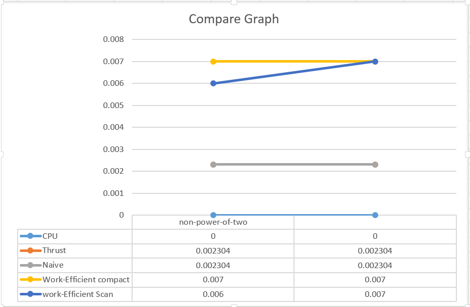

CUDA Stream Compaction
======================

**University of Pennsylvania, CIS 565: GPU Programming and Architecture, Project 2**

* Xinyue Zhu
* Tested on: Windows 10, i5-5200U @ 2.20GHz 8GB, GTX 960M 

### README
The results are marked by the number of requirements.

### Questions

* GPU Scan implementations (not included in code)(Naive, Work-Efficient, and
  Thrust) to the serial CPU version of Scan. 
  
*the time line of thrust is seperate. It runs evey few seconds.
	
* The CudaMalloc function take over 167439 us. Over half of the time.This I/O is bottlenenecks.
    The I/O time of deferent method is different. Because some methods needs to allocate more places in device. 
  

*Output:
  
****************
** SCAN TESTS **
****************
    [  38  19  38  37   5  47  15  35   0  12   3   0  42 ...  26   0 ]
==== cpu scan, power-of-two ====
    1.1    [   0  38  57  95 132 137 184 199 234 234 246 249 249 ... 6203 6229 ]
==== cpu scan, non-power-of-two ====
    1.1    [   0  38  57  95 132 137 184 199 234 234 246 249 249 ... 6146 6190 ]
    passed
==== naive scan, power-of-two ====
    2.1    [   0  38  57  95 132 137 184 199 234 234 246 249 249 ... 6203 6229 ]
    passed
==== naive scan, non-power-of-two ====
    2.1    [   0  38  57  95 132 137 184 199 234 234 246 249 249 ... 6203 6229 ]
    passed
==== work-efficient scan, power-of-two ====
    3.1
    [   0  38  57  95 132 137 184 199 234 234 246 249 249 ... 6203 6229 ]
    passed
==== work-efficient scan, non-power-of-two ====
3.1
    [   0  38  57  95 132 137 184 199 234 234 246 249 249 ... 6146 6190 ]
    passed
==== thrust scan, power-of-two ====
4.1    passed
==== thrust scan, non-power-of-two ====
4.1    passed

*****************************
** STREAM COMPACTION TESTS **
*****************************
    [   2   3   2   1   3   1   1   1   2   0   1   0   2 ...   0   0 ]
==== cpu compact without scan, power-of-two ====
1.2
    [   2   3   2   1   3   1   1   1   2   1   2   1   1 ...   2   1 ]
    passed
==== cpu compact without scan, non-power-of-two ====
1.2
    [   2   3   2   1   3   1   1   1   2   1   2   1   1 ...   3   2 ]
    passed
==== cpu compact with scan ====
1.3
    [   2   3   2   1   3   1   1   1   2   1   2   1   1 ...   2   1 ]
    passed
==== work-efficient compact, power-of-two ====
3.2
    [   2   3   2   1   3   1   1   1   2   1   2   1   1 ...   2   1 ]
    passed
==== work-efficient compact, non-power-of-two ====
3.2
    [   2   3   2   1   3   1   1   1   2   1   2   1   1 ...   3   2 ]
    passed

